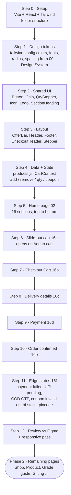
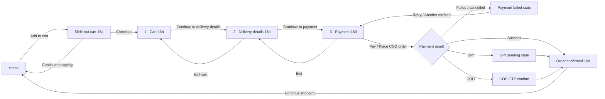

# Durai Cashew — Build Flow (Phase 1: Home → Payment)

Source: Figma `draft-1` → Section 1 (node 31:4069)

## 1. Work plan (the order I build in)

## 2. User flow (what the shopper does)

## 3. Home page sections (Figma 02 · Home, 14:2)

| # | Section | Figma node | Component |
|---|---------|-----------|-----------|
| 1 | Offer bar | 14:3 | `components/layout/OfferBar.jsx` |
| 2 | Header | 14:8 | `components/layout/Header.jsx` |
| 3 | Hero | 14:35 | `pages/home/sections/Hero.jsx` |
| 4 | Bestsellers shelf | 14:116 | `Bestsellers.jsx` (Add to cart) |
| 5 | Shop by mood | 14:85 | `ShopByMood.jsx` |
| 6 | Grade story | 14:296 | `GradeStory.jsx` |
| 7 | From tree to tin | 14:401 | `TreeToTin.jsx` |
| 8 | (Freshness promise — removed in v3) | 14:445 | `FreshnessPromise.jsx` |
| 9 | Gifting spotlight | 15:199 | `GiftingSpotlight.jsx` |
| 10 | People behind Durai | 15:313 | `People.jsx` |
| 11 | Reviews & UGC | 15:332 | `Reviews.jsx` |
| 12 | Journal teaser | 15:407 | `JournalTeaser.jsx` |
| 13 | Subscribe & save banner | 15:426 | `SubscribeBanner.jsx` |
| 14 | Newsletter + WhatsApp | 15:434 | `Newsletter.jsx` |
| 15 | Footer | 15:450 | `components/layout/Footer.jsx` |

## 4. Checkout screens

| Screen | Figma node | Route | Component |
|--------|-----------|-------|-----------|
| Slide-out cart | 26:3395 | overlay | `components/cart/CartDrawer.jsx` |
| Checkout — Cart | 26:3485 | `/checkout/cart` | `pages/checkout/CartPage.jsx` |
| Delivery details | 26:3627 | `/checkout/delivery` | `pages/checkout/DeliveryPage.jsx` |
| Payment | 27:3458 | `/checkout/payment` | `pages/checkout/PaymentPage.jsx` |
| Order confirmed | 27:3840 | `/order/confirmed` | `pages/checkout/ConfirmedPage.jsx` |
| Checkout states | 27:3977 | modals / inline | `components/checkout/states/*` |

## 5. Design tokens (from 00 · Design System)

| Token | Hex | Use |
|-------|-----|-----|
| ivory | #F7F0E4 | Page background |
| roast | #3A2317 | Headings, body |
| sand | #E9D9BF | Cards, bands |
| apple | #C8442C | Primary CTA |
| gold | #C99A45 | Foil, dividers, checkout CTA |
| leaf | #2E4A3A | Trust, success bands |
| night | #1D1512 | Gifting sections, offer bar |
| muted | #7A6556 | Captions |
| line | #DCCCB2 | Borders |
| error | #B3261E | Errors |
| success | #2E7D4F | Confirmed |

Fonts: **Fraunces** (display/headings) · **Manrope** (UI/body) · **DM Mono** (data) · **Hind Madurai** (Tamil)
Radius: 8 inputs · 20 cards · 32 media · pill buttons. Grid: 1280 max, 80px page padding.

## Progress

- [x] Step 0 · Setup (Vite, React, Tailwind, shadcn/ui)
- [x] Step 1 · Tokens
- [x] Step 2 · Shared UI (shadcn primitives + brand components)
- [x] Step 3 · Layout
- [x] Step 4 · Data + state
- [x] Step 5 · Home
- [x] Step 6 · Cart drawer
- [x] Step 7 · Checkout cart
- [x] Step 8 · Delivery
- [x] Step 9 · Payment
- [x] Step 10 · Confirmed
- [x] Step 11 · States
- [x] Step 12 · Review — desktop 1440 + mobile 390 screenshots checked against Figma

## Figma inconsistencies resolved in code

- Free-delivery threshold: one constant (`FREE_DELIVERY_AT`) drives drawer and cart page.
- Upsell: one `UPSELL` definition (Honey Glazed 100 g, ₹249) used in both places.
- Delivery address: saved and new addresses are one radio group — only one can be active.
- Slide-out cart now has a remove (trash) button.
- Delivery dates are computed from today, not hard-coded.
- Checkout mock prices (₹200 items) replaced by the home-page prices so totals are consistent.

## Next (Phase 2)

03 Shop all → 04 Product page → 05 Grade guide → 06 Subscribe → 07–09 Gifting → 10 Wholesale →
11 Our story → 12 Quality → 13–14 Journal → 15 Contact → 17 Account → 18 Track order → 19 FAQ

## Phase 2 progress

- [x] 03 · Shop all (`/shop`, node 39:4993) — filter bar (URL-synced), sort, 3-col grid, compare checkbox, grade-guide tile, empty state, all-filters sheet. Header nav is now real routes (Subscribe added).
- [x] 04 · Product page (`/shop/:id`, node 39:5143) — gallery + zoom, pack/subscribe selectors, pincode check, trust strip, spec/taste, nutrition/batch, recipes, reviews + Q&A, pairs + bundle, mobile sticky bar. Shop cards link to it.
- [x] 06 Subscribe (`/subscribe`) · 07 Gifting hub (`/gifting`) · 08 Gift box builder (`/gifting/build`) · 09 Corporate gifting (`/gifting/corporate`)
- [x] 10 Wholesale (`/wholesale`) · 11 Our story (`/our-story`) · 13 Journal (`/journal`) · 14 Article (`/journal/:slug`) · 15 Contact (`/contact`)
- [x] 17 Account (`/account`) · 18 Track order (`/track-order`) · 19 FAQ (`/faq`) and policies (`/policies/:slug`)
- Added after QA: /grades, /flavours, /quality, /sustainability, /careers, /press, /stores, /sitemap, /search, /compare and a real 404. Still not designed in Figma: login/sign-up, wishlist page, admin dashboard.
